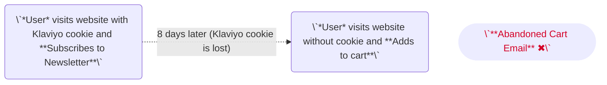
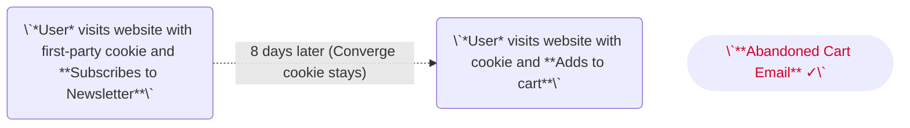

import { Icon, IconText } from '/snippets/icons.mdx';
import { OutboundLink } from '/snippets/links.mdx';

## Overview

Connection Type: <IconText text="Client-side" name="browser" iconType="duotone" iconLocation="after"/>  and <IconText text="Server-side" name="server" iconType="duotone" iconLocation="after"/>

---

## Installation Instructions

1. Navigate to your <OutboundLink linkTarget="https://www.klaviyo.com/settings/account/personal" linkText="Klaviyo Admin Dashboard"/>.

2. In the left-bottom corner of the dashboard, click on your Klaviyo Workspace Name and then on <IconText text="Settings" name="gear" iconLocation="before" iconType="regular"/>
  <Frame>
    
  </Frame>

3. Under the **Account**-tab, choose **API keys**.

4. Copy your **Public API Key**, you will need it later.

5. Click on **Create Private API Key**

6. Give your key a name and select **Custom Key** in **Select Access Level**

7. Select **Read/Write Access** to the **Events** scope.
  <Frame>
    
  </Frame>

8. Press **Create**

9. Copy the newly created **Private API Key**, you will need it later.

10. In your Converge dashboard, under Connections, click <IconText name="circle-plus" text="Create New Connection" iconLocation="before" iconType="regular"/ > and fill in your **Public API Key** in the **Public Token** field and your **Private API Key** in the **API Key**-field. 

11. Click on the **Advanced**-tab to set up your events.
  <Frame>
    
  </Frame>

12. Choose the events for which you want to set up the Converge Connection. 
    <Note>
      If you are using any of Klaviyo's prebuilt integrations, then you will want to make sure **not** to send `Started Checkout` and `Placed Order` events. Otherwise, you will want to send all events.
    </Note>

13. Click on **Create Connection**.

---

## Converge functionality

This integration supports the following Converge connection functionality.

| Converge Feature        |       Supported       |
| ----------------------- | :-------------------: |
| Custom Events           | <Icon name="check" /> |
| Filters                 | <Icon name="xmark" /> |
| Server-side Conversions | <Icon name="check" /> |


---

## Using Converge to increase abandoned cart revenue on Klaviyo

You may already be using Klaviyo's abandoned cart flows based on the `Added To Cart`-events and `Started Checkout`-events tracked by the Klaviyo pixel on the browser. 

However, Klaviyo's browser identification is based on a third-party cookie meaning that most customers will not be successfully identified after 7 days (see our section on <OutboundLink linkText="Cookie Behavior" linkTarget="/sources/concepts/aliases#default-cookie-behavior"/> ).



When Converge is set up with a first-party cookie, it can reliably re-identify customers past that 7-day mark (see: [Setting up a server-side first-party cookie](/sources/concepts/aliases#setting-up-a-server-side-first-party-cookie)).
Customers using our pre-built [Shopify](/sources/website-integrations/shopify) or [Magento](/sources/website-integrations/magento) integrations already have a first-party cookie as part of their Converge setup.



For most customers, we expect an abandoned cart revenue uplift of 20-50%.

## Adding product URL and image URL to Converge events to power Klaviyo flows

A common use case of the Klaviyo Destination is to build Klaviyo Email Flows based on Converge Events. 
As such, you might want to include a Product URL or Product Image URL in the Converge Event so you can leverage these in your email flows. 

To that end, you will want to extend the Converge Event Spec for the following events.
Once you add the custom properties to your events, Converge will automatically forward these to the Klaviyo Destination.


### Extending your Converge Event implementation for Klaviyo

Find code examples below that illustrate where **you should add the Product URL and Product Image URL custom event properties**.

<AccordionGroup>
<Accordion title="Viewed Product" icon="code">

See the original `Viewed Product` spec [here](/sources/converge-spec.mdx#viewed-product)

<CodeGroup>

```javascript JavaScript
cvg({
  method: "track",
  eventName: "Viewed Product",
  properties: {
    product_id: "123456",
    variant_id: "78910", 
    sku: "MY_SKU",
    name: "My Product",
    variant_name: "Vanilla", 
    price: 42,
    currency: "USD",
    vendor: "My Store",
    url: "https://mystore.com/this-product" // This is new
    image_url: "https://mystore.com/assets/product.png" // This is new
  },
});
```

</CodeGroup>

</Accordion>

<Accordion title="Added To Cart" icon="code">

See the original `Added To Cart` spec [here](/sources/converge-spec.mdx#added-to-cart)

<CodeGroup>

```javascript JavaScript
cvg({
  method: "track",
  eventName: "Added To Cart",
  properties: {
    product_id: "123456",
    variant_id: "78910",
    sku: "MY_SKU",
    name: "My Product",
    variant_name: "Vanilla",
    price: 42,
    currency: "USD",
    quantity: 1,
    vendor: "My Store",
    url: "https://mystore.com/this-product" // This is new
    image_url: "https://mystore.com/assets/product.png" // This is new
  },
});

```

</CodeGroup>

</Accordion>

<Accordion title="Removed From Cart" icon="code">

See the original `Removed From Cart` spec [here](/sources/converge-spec.mdx#removed-from-cart)

<CodeGroup>

```javascript JavaScript
cvg({
  method: "track",
  eventName: "Removed From Cart",
  properties: {
    product_id: "123456",
    variant_id: "78910",
    sku: "MY_SKU",
    name: "My Product",
    variant_name: "Vanilla",
    price: 42,
    currency: "USD",
    quantity: 1,
    vendor: "My Store",
    url: "https://mystore.com/this-product" // This is new
    image_url: "https://mystore.com/assets/product.png" // This is new
  },
});

```

</CodeGroup>

</Accordion>

</AccordionGroup>


--- 

## FAQ

<AccordionGroup>
<Accordion title="I already have the Klaviyo integration for Shopify, should I also set up a Converge connection?">
  If you are using any of Klaviyo's prebuilt integrations, then there is still value in setting up the Converge Klaviyo Connection to track the `Viewed Product`, `Viewed Category`, and `Added To Cart` events or to send [Custom Events](/sources/extending-the-spec/custom-events) to Klaviyo.
</Accordion>
</AccordionGroup>

---

## Event Mapping

Converge automatically maps the following events from the [Converge Event Spec](/sources/converge-spec) to the Klaviyo spec.

| Converge Event Name                                           | Klaviyo Event Name |
| ------------------------------------------------------------- | ------------------ |
| [$page_load](/sources/converge-spec#page-load)                | `__activity__`     |
| [Viewed Product](/sources/converge-spec#viewed-product)       | `Viewed Product`   |
| [Viewed Collection](/sources/converge-spec#viewed-collection) | `Viewed Category`  |
| [Added To Cart](/sources/converge-spec#added-to-cart)         | `Added to Cart`    |
| [Started Checkout](/sources/converge-spec#started-checkout)   | `Started Checkout` |
| [Placed Order](/sources/converge-spec#placed-order)           | `Placed Order`     |


This integration also auto-tracks some additional events that are not part of the Meta Base Spec but are so heavily requested that we automatically forward them.

| Converge Event Name | Klaviyo Event Name |
| ------------------- | ------------------ |
| Ordered Product     | `Ordered Product`  |