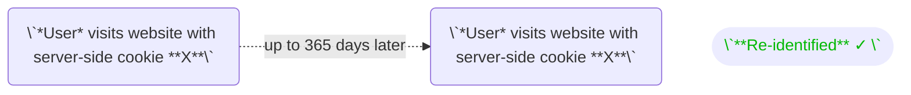

import {OutboundLink} from '/snippets/links.mdx';

Converge excels at matching events across browser sessions and your server-side data. This is all possible through aliases. 
Your customer is linked to multiple aliases, i.e. **multiple identifiers for the same customer**. 

Converge uses the customer's browser session cookie as the default alias.
When you add something as an alias, you are telling Converge that this alias is a unique identifier for this profile **across datasources**. 

As an example, Converge can merge a profile of browser events (e.g. Pageviews) with a profile with backend events (e.g. Started Subscription) if they have the same `email`.

Other aliases that are useful:
- `cart_token`
- `checkout_token`: this is absolutely necessary if your checkout lives on a different domain than your storefront token.
- `customer_id`

<Accordion title="Code Examples" icon="code">
 <CodeGroup>

```javascript Converge Pixel - Javascript
cvg({
  method: "track",
  eventName: "Subscribed To Newsletter",
  properties: {},
  profileProperties: {},
  aliases: ["urn:email:john.smith@apple.com"],
});
```

```python Converge Webhook - Python
resp = requests.post(
    "{YOUR_POSTBACK_ENDPOINT}",
    json=
        {
        "event_name": "Subscribed To Newsletter",
        "properties": {},
        "profile_properties": {},
        "aliases": ["urn:email:john.smith@apple.com"],
    }
)
```


</CodeGroup>
</Accordion>

---

## Aliases for re-identification

### Default cookie behavior

Many browsers wipe all third-party cookies and all cookies that are set browser-side through JavaScript. 
For example, **Safari will wipe all of those cookies after 7 days**. 

This significantly impacts the accuracy of multi-touch attribution.
Observe in the graph below how a customer who comes to your site in an interval longer than 8 days cannot be re-identified.


For a full list of browsers and their cookie lifetimes, see <OutboundLink linkText="here" linkTarget="https://www.cookiestatus.com/#current-status" />


### Server-side first-party cookies

The reliable way to re-identify users over longer periods of time is through **server-side first-party cookies**. 
As illustrated in the graph below, these do reliably re-identify users.





### Leveraging server-side first-party cookies within Converge

By using a server-side first-party cookie as an **alias**, Converge can:
1. **Reliably re-identify your customers for multi-touch attribution**. This is especially important for brands where the buying cycle is longer than the cookie lifetime of 7 days.
2. **Extend the lifetime of third-party cookies**: Converge stores third-party cookies that are relevant for your Connections in its <OutboundLink linkText="profile properties" linkTarget="/sources/concepts/profile-properties"/>. Converge can then retrieve these third-party cookies when it recognizes a customer after the 7-day period.

---

## Setting up a server-side first-party cookie

If you are using one of the Converge prebuilt integrations (e.g. for Shopify) then you are likely already using a server-side first-party cookie.
Check out your specific integration documentation to verify.

If you are integrating [Converge JS](/sources/website-integrations/converge-pixel) on your website, then you will need to implement this directly yourself.

### Installation Instructions

<AccordionGroup>

    <Accordion title="Set up a first-party server-side cookie" icon="server" >
    
    We provide a minimal code example below for NodeJS, but any server web framework should be able to handle server-side cookies.

   <CodeGroup>
   
   ```js Node.JS Server
    // server.js

    const express = require('express');
    const cookieParser = require('cookie-parser');
    const uuid = require('uuid');

    const app = express();
    const PORT = 3000;

    app.use(cookieParser());

    // Middleware to generate and set unique visitor cookie if not already set
    app.use((req, res, next) => {
    if (!req.cookies.visitorId) {
        const visitorId = uuid.v4(); // Generate a unique visitor ID
        res.cookie('mystore_uid', visitorId, { maxAge: 365 * 24 * 60 * 60 * 1000, httpOnly: true });
    }
    next();
    });

    // Route to serve Next.js application
    app.use('/', require('./frontend'));

    app.listen(PORT, () => {
    console.log(`Server is running on port ${PORT}`);
    });
   ```
   </CodeGroup>
 

   </Accordion > 

   <Accordion title="Pass the cookie as an alias in all of your client-side ConvergeJS calls" icon="cookie" >
    
    Modify the code where you set up the `page_load` to include the cookie you set up above as an `alias`.
    We provide an example for NextJS, but this should be straightforwardly implemented in any framework.
    
    ```js NextJS
    import { useEffect } from "react";
    import Cookies from 'js-cookie';

    const MyApp = ({ Component, pageProps, router }) => {
    useEffect(() => {
        const visitorId = Cookies.get('mystore_uid');
        const handleRouteChange = (url) => {
        cvg({method: "track", eventName: "$page_load", aliases: [`urn:mystore_uid:${visitorId}`]})
        };
        router.events.on("routeChangeComplete", handleRouteChange);
        return () => {
        router.events.off("routeChangeComplete", handleRouteChange);
        };
    }, []);
    return <Component {...pageProps} />;
    };
    export default MyApp;
    ```

   </Accordion >
   </AccordionGroup>

---
