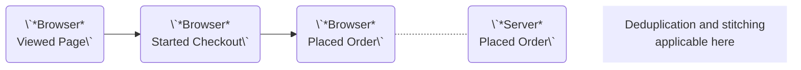
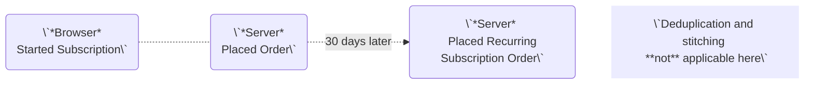

Sales channels categorize individual events based on their specific tracking context, such as browser, mobile application, or POS. 
This classification does not impact how [stitching](/sources/concepts/aliases) or [deduplication](/sources/concepts/deduplication) are performed but rather ensures that any insights and warnings are increasingly accurately aligned with the nature of each event. 
By distinguishing these events through sales channels types, Converge can provide more precise insights into a healthy Converge setup and highlight any areas of concern.

#### Example 1: Browser and Server "Placed Order" Event



In this example, a 'Placed Order' event is initiated on the browser with a corresponding 'Placed Order' event being received from a server side datasource. 
We want concepts like deduplication and session stitching to be applicable and relevant here.
By categorizing both as "web," Converge can ensure that calculations and insights reflect a true picture of the setup without introducing irrelevant discrepancies from non-web sources where deduplication or stitching may not make sense.

#### Example 2: Subscriptions



For this example, a "Started Subscription" event is captured on the browser, followed by a "Placed Order" event from the server side, indicating a successful subscription start. These events will be categorized as a "web" sales channels given the user web journey. However, thirty days later, the server sends Converge a "Placed Recurring Subscription Order." This event is categorized as a "Subscription" sales channels because it is an automated event rather than a user-initiated event.

Since there is no corresponding browser interactions for the recurring subscription order, concepts like deduplication and session stitching are not applicable or necessary in this scenario. By using a different sales channels to "web" it means such events are not mistakenly associated with user actions and ensure deduplication and session stitching rates remain accurate.

## Supported Sales Channels

We support a number of sales channels types:

| Name           | Property Value        | Description                                                          |
| -------------- | --------------------- | -------------------------------------------------------------------- |
| Web            | web                   | Events occurring via browser-based interactions and actions          |
| Subscriptions  | subscription_contract | Automated events related to subscription renewals or contracts.      |
| SMS            | sms                   | Events or interactions triggered via SMS/Text communication.         |
| Mobile App     | mobile_app            | User interactions occurring within mobile applications.              |
| POS            | pos                   | Point of Sale transactions taking place in physical stores.          |
| Marketplace    | marketplace           | Sales and interactions through third-party marketplaces like Amazon. |
| Offline        | offline               | Offline events such as amended orders, manual orders, or calls.      |
| Facebook Shop  | facebook_shop         | Purchases and interactions through the Facebook Shop channels.       |
| Pinterest Shop | pinterest_shop        | Sales and activity through the Pinterest Shop channels.              |
| TikTok Shop    | tiktok_shop           | Orders and interactions made via the TikTok Shop channels.           |

## Implementation

Sales channels are introduced via an event's event properties using the `$sales_channel_type` property. 
All events sent from the Converge pixel are categorized as a "web" sales channel type. 
If an event is received by Converge from a server side integration like Shopify, Bigcommerce, Firmhouse, Woocommerce, a mapping occurs. 
Custom integrations like webhooks require manual instrumentation of the property.

<Note> By default, if `$sales_channel_type` is not passed (e.g. custom integration), or a mapping cannot be found (server integration), Converge defaults to "web" </Note>

   <CodeGroup>
```python Python - Server-side
resp = requests.post(
    "{YOUR_POSTBACK_ENDPOINT}",
    json=
        {
        "event_name": "Placed Order",
        "event_id": "order-1", # your order id, necessary for deduplication
        "properties": {
            # event properties
            "$sales_channel_type": "web",  # important, see supported sales channels
        },
        "profile_properties": {
            # Pass as many as possible
            "$first_name": "John",
            "$last_name": "Smith",
            "$email": "john.smith@apple.com",
            "$phone_number": "+199999999",
            "$city": "San Francisco",
            "$country_code": "US",
            "$state": "California",
            "$zip_code": "94103",
        },
        # important, this will be used for stitching backend orders to website sessions
        "aliases": ["urn:email:john.smith@apple.com"],
    }
)
```

</CodeGroup>